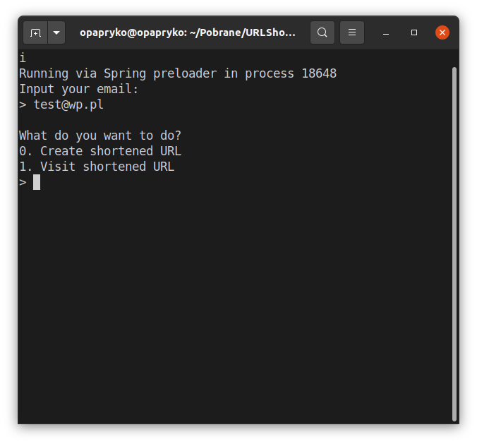

# Rails URL Shortener CLI Version

## Features

Creating users with given email

Creating short URL with given link

Opening relevant links from shortened links

Track URL visits

## Run app
```bash
rails runner bin/cli
```

## CLI
